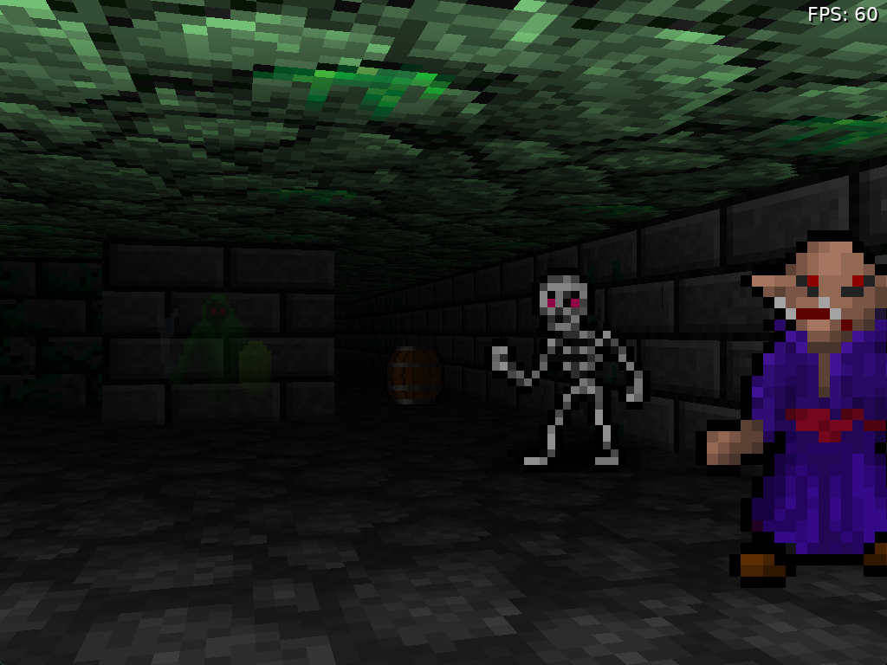

# Lua Dungeon

A first person game made with [Love2D](https://love2d.org/)

## Notes

A web/JS version is built using [love.js](https://github.com/Davidobot/love.js) and published here https://code.benco.io/lua-dungeon/  
I don't know if I'll keep this as it often behaves strangely compared to the native version.

## Building

### Pre-reqs

- Download love2d from https://love2d.org/
- Either extract somewhere on your system or run the installer

### Windows

- Clone the repo (dhur!)
- Open a Powershell session in the project root
- Run `tools\build-win.ps1 -lovePath <path to love.exe>`
  - Change the path as required, if you used the windows installer it's probably `C:\Program Files\LOVE\love.exe`

Alternatively clone & open the project is VSCode and hit `ctrl+shift+B` to run the build task

The binary will be saved as `out.exe` in the dist directory, and should be runnable on any Windows system

### Linux

Kinda the same as above, but run `./tools/build-linux.sh` you can run the script with the defaults and it should be fine. Output Linux executable will be `./dist/out`

## Attributions

I used several sources of information and assets:

- Graphics - https://opengameart.org/content/dungeon-crawl-32x32-tiles-supplemental
- Raycasting - https://lodev.org/cgtutor/raycasting.html
- Raycasting More - https://github.com/wernsey/lodev-enhance
