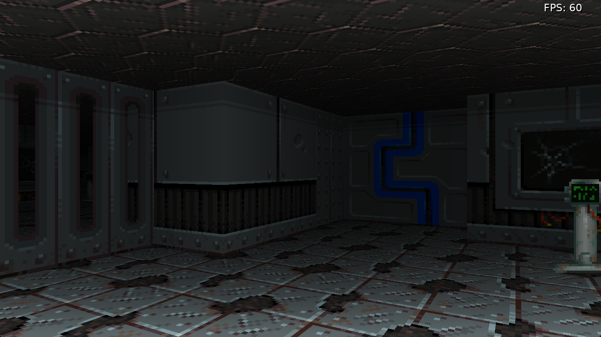
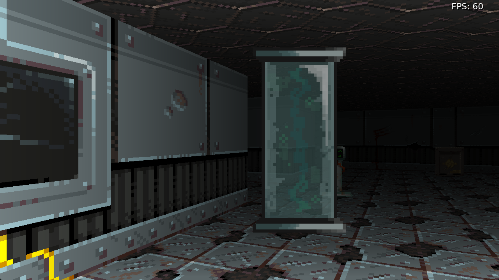

# ⚔️ Lua 3D Game

A first person game/engine made with [Love2D](https://love2d.org/). Heavily WIP.

My second experiment with raycasting, this time I'm using Lua/Love2D. I want to add more features to the engine this time such as textured floors, doors etc. Game might be a shooter or more puzzle/rpg/melee based. Might actually switch to a sci-fi setting dunno.

It's using standard raycasting techniques such as those outlined in the excellent [Lode's Computer Graphics Tutorial](https://lodev.org/cgtutor/raycasting.html)

The raycasting calculations and sprite positioning are done in software with classic raycasting approach, then sent to the GPU using shaders to draw wall strips & sprites. Floors and ceilings are done with a fullscreen shader entirely on the GPU.

Current features:

- Textured walls
- Textured floors and ceilings
- Sprites for items, creatures and things
- Thin walls with see through sections, partial alpha
- Doors
- Light falloff

## 🕹️ Controls

- Arrow keys / WASD: Move & turn
- F: Fullscreen
- Esc: Quit

## 📃 Notes

A web/JS version is built using [love.js](https://github.com/Davidobot/love.js) and published here https://code.benco.io/lua-game/  
I don't know if I'll keep this as it often behaves strangely compared to the native version.

## 💾 Download & Install

Binaries are built as part of CI when main branch is updated, navigate to latest run (I can't find a way to permalink to this) and download the 'Lua Dungeon Windows Build' zip file, extract and run the lua-game.exe file. It's safe!

## 🛠️ Building

### Pre-reqs

- Download love2d from https://love2d.org/
- Either extract somewhere on your system or run the installer

### Windows

- Clone the repo (dhur!)
- Open a Powershell session in the project root
- Run `tools\build-win.ps1 -lovePath <path to love.exe>`
  - Change the path as required, if you used the windows installer it's probably `C:\Program Files\LOVE\love.exe`

Alternatively clone & open the project is VSCode and hit `ctrl+shift+B` to run the build task

The binary will be saved as `out.exe` in the dist directory, and should be runnable on any Windows system

### Linux

Kinda the same as above, but run `./tools/build-linux.sh` you can run the script with the defaults and it should be fine. Output Linux executable will be `./dist/out`

## 👍 References

I used several sources of information, see ATTRIBUTION.md for more details

- Raycasting - https://lodev.org/cgtutor/raycasting.html
- Raycasting More - https://github.com/wernsey/lodev-enhance
